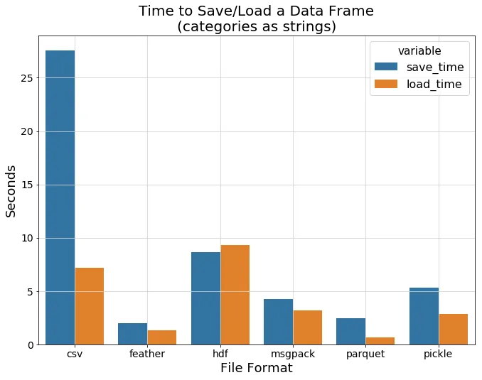
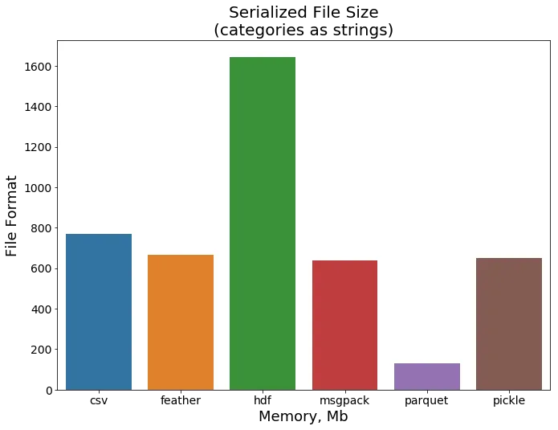

# DU-project-1

## Project 1 Directions

- Instructions for [project 1](Project_1_Overview_DU_Bootcamp.md)

## Project Ideation: US Weather Analysis

### Questions to be answered

1. What areas of the country have ideal temperature for a particular individual?
    1. Some individuals like hot, others like cool, etc.
2. For people who like it hot, what are the ideal areas
3. For people who like cold winters, what are the ideal areas
4. For people who like very temperate weather, what are the ideal areas
5. What areas of the country have less 

### Analysis

**Analysis results:**  What is the typical weather and weather extremes across the U.S.  

Pull in weather data for a year and determine the number of days in each temperature range.  Candidate temperature ranges would be bins (-30..120 in 5 degree increments).  Collate and plot the results by zip code or county (we will pick one).

After analyzing data sources it is difficult to find a publicly available source to convert station lat/lon to zip-code.  FCC will convert to county.  Google can convert to zip code for use with google maps, but not with other mapping destination. 

# Thomas  -The google API may not be needed below:
1. **zip codes:**  use google API and google maps.  This will involve using modified KML file for zip code boundaries. 
2. **counties:** use FCC API and plotly
#### Step 1: Pull in and organize weather data by weather station

- Import file (2023.csv)
- drop extra columns
- drop all non-US,CA stations
- drop all rows not using TMAX, TMIN, TAVG or PRCP data
- Combine all station information for each day and station
- Fix all NaN values in TMAX, TMIN, TAVG and PRCP columns
- Save results (all stations for each day of the year) in parquet zipped file

## Additions to Step 1 4/11/2024 Thomas

 # Thomas - Weather Data contains both Lattitude and Longitude as well as state and zip code of the Weather Station.
 
 # FORMAT OF "ghcnd-stations.txt"  

# ------------------------------
# Variable   Columns   Type
# ------------------------------
# ID            1-11   Character
# LATITUDE     13-20   Real
# LONGITUDE    22-30   Real
# ELEVATION    32-37   Real
# STATE        39-40   Character     STATE is the U.S. postal code for the state (for U.S. stations only).
# NAME         42-71   Character
# GSN FLAG     73-75   Character
# HCN/CRN FLAG 77-79   Character
# WMO ID       81-85   Character
# ------------------------------

# FORMAT OF "ghcnd-states.txt"

# ------------------------------
# Variable   Columns   Type
# ------------------------------
# CODE          1-2    Character
# NAME         4-50    Character
# ------------------------------

# These variables have the following definitions:

# CODE       is the POSTAL code of the U.S. state/territory or Canadian 
# province where the station is located 

# NAME       is the name of the state, territory or province.

 # the above can be found at https://www1.ncdc.noaa.gov/pub/data/ghcn/daily/readme.txt


 #### Step 2: Create station summary information
Goal: How many days of year in each temperature range

- Create bins for highs (50-55, 55-6, …. 95-100, 100-105) etc
- Create bins for lows
- <or> Alternate: may also try bins for days > 80, days > 90, days < 30 etc.
- Save results

Result should look like:
| Station ID | #days < 10 | #days < 20 | ... | #days < 65 | #days > 60 | ... | #days > 95 | # days > 100 |
|----|----|----|----|----|----|----|----|----|
| US001 | 0 | 0 | ... | 300 | 365 | ... | 45 | 20 |
| US002 | 5 | 15 | ... | 360 | 280 | ... | 5 | 0 |


#### Step 3: Plot summary information on plotly or google maps
Create maps for each temperature bin or category

    - Option 1: plotly
        - create a map for a temperature bin with small circle around each station
        - circle should be colored based on the temperature bin value
    - Option 1: google maps
        - create a map for a temperature bin with small circle around each station
        - circle should be colored based on the temperature bin value

#### Step 4: Calculate Housing median prices for counties

| County name | median price |
| ------------ | ----------- |
| Araphaoe | 612000 |
| Douglas | 630000 |

#### Step 5: Plot housing median prices

- Use county based ploty map
- Color code each county by median price

#### Step 6: Extra Credit (All stations where temperature is between 40 & 80 340 days of the year) and overlay on median housing data

- make min temp (40) a variable
- make max temp (80) a variable
- make #days in range (340) a variable
- create map


------------------------------------------
### Optional

#### (Optional) Summarize and plot temps per county or zip code
- Determine how to use shape files from US census, color code and import into mapping program
    - Options:  
        1. [google maps]
        2. [plotly maps](https://plotly.com/python/county-choropleth/#the-entire-usa)
- Create map for each temperature range 

#### (optional) Take station information and combine for zip code or county

**Note** zip code may provide finer granularity for plotting.  Consider creating and saving two datasets (stations aggregated by county and stations aggregated by zipcode)

- Read station lat lon
- perform fcc query for county
- combine all station info (max, min, avg, precip) for all stations in each county
- combine into new df
- Query for county or zip code 
- Add to combined df
- Process all counties or zip and combine / average all data (high, low, precip)
- Save results

#### (Optional) Consider creating a movie showing the progression of temps across maps

- Create movie or possibly a presentation with each map slide transitioning to the next every few seconds.

#### (Optional) Add in housing characteristics per zip code

- [Housing Characteristics at Proximity one](https://proximityone.com/zip18dp4.htm)
- [Housing data - US Census](https://www.census.gov/library/video/2023/adrm/downloading-exporting-and-sharing-2020-census-demographic-and-housing-characteristics-data.html)
- Need to check license.

#### Resources:

- Data Reshaping
    - [Medium article on advanced reshaping](https://baotramduong.medium.com/python-for-data-science-pivot-vs-52dd3879078f) with pivot, melt, stack, pivot_table, wide_to_long, crosstab, & concat
- Weather
    - [NOAA daily weather data](https://www1.ncdc.noaa.gov/pub/data/ghcn/daily/by_year/) ~ 158 MB/year
    - [GHCND file info](https://docs.opendata.aws/noaa-ghcn-pds/readme.html) with station ID decoder ring
- County / Zipcodes: 
    - [Convert lat lon to zip code](https://gis.stackexchange.com/questions/352961/converting-lat-lon-to-postal-code-using-python)
    - get county info from lat / lon
        - [fcc / census](https://geo.fcc.gov/api/census/#!/block/get_block_find)
            - [FCC API terms of service](https://www.fcc.gov/reports-research/developers/api-terms-service)
            - example
            ```
            https://geo.fcc.gov/api/census/block/find?latitude=39.6667&longitude=-104.0284&censusYear=2020&showall=true&format=json
            ```
        - Google Maps [license](https://developers.google.com/maps/terms-20180207)
        ```
        $x = file_get_contents("http://maps.google.com/maps/geo?ll=10.345561,123.896932");
        $j_decodex = json_decode($x);
        print_r($j_decodex);

        or 


        ```

    - Simplemaps 
        - [counties](https://simplemaps.com/data/us-counties)
        - [zipcodes](https://simplemaps.com/data/us-zips)
- Visualization
    - County / Zipcode shape files: 
        - County KML Shapefiles: [US Census Cartographic Boundary Files (2022)](https://www.census.gov/geographies/mapping-files/time-series/geo/cartographic-boundary.2022.html)
        - Zipcode KML Shapefiles: [US Census Cartographic Boundary Files (2020)](https://www.census.gov/geographies/mapping-files/time-series/geo/cartographic-boundary.2020.html)
    - Manipulate KML files: [fastKML](https://fastkml.readthedocs.io/en/latest/)
    - Google Maps:
        - [How To Import Shapefile Into Google Maps || Embed Google Maps In Your Website || The GIS Hub](https://www.youtube.com/watch?v=tfmVe2bY724)
        - [Add a KML files to google maps](https://support.google.com/maps/thread/237045555/how-to-add-a-polygon-shapefile?hl=en)
    - Plotly: Looks pretty simple
        - [plotly choropleth map](https://plotly.com/python/choropleth-maps/)
        - [County Example](https://plotly.com/python/county-choropleth/#simple-example)
        -   May need to determine plotly code for each county and merge into dataframes in Step 2 above
        - Zip Codes
            - [Medium Articles on zip code plots](https://medium.com/@mm.fuenteslopez/using-plotly-express-to-make-zip-code-level-choropleth-maps-a8ac8212b7ed)
            - [Zip Code Geojson files](https://github.com/OpenDataDE/State-zip-code-GeoJSON)
                - will need to determine how to provide value for each zipcode.
- median Home prices:
    - [US Census data](https://data.census.gov/table/ACSDT5Y2022.B25077?t=Financial%20Characteristics:Housing%20Value%20and%20Purchase%20Price&g=010XX00US$8600000&y=2022) - datasets: B2503, B2506, B2507 & DP04
    - [nar.realtor pdf report](https://www.nar.realtor/research-and-statistics/housing-statistics/county-median-home-prices-and-monthly-mortgage-payment)
- Storing Large files

    - [Toward Data Science Article](https://towardsdatascience.com/the-best-format-to-save-pandas-data-414dca023e0d)
    -  


#### Example map in plotly:


