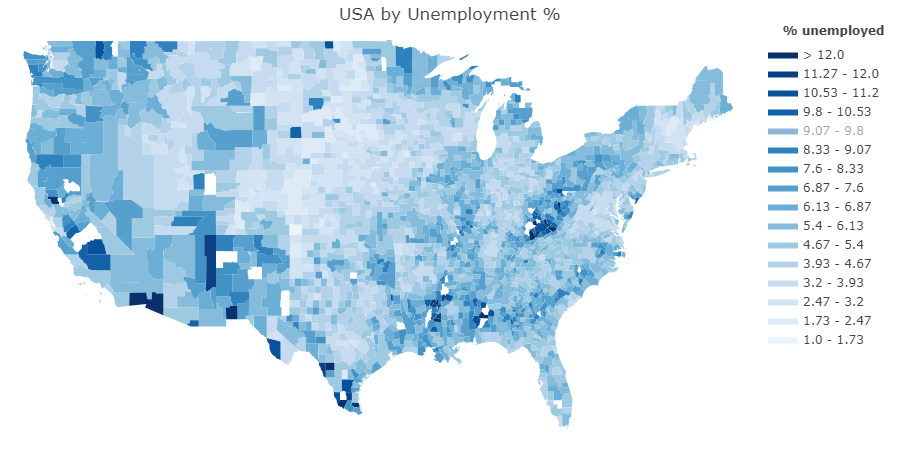

# DU-project-1

## Project Ideation:

### Idea 1:  US Weather Analysis

**Analysis results:**  What is the typical weather and weather extremes across the U.S.  

Pull in weather data for a year and determine the number of days in each temperature range.  Candidate temperature ranges would be bins (-30..120 in 5 degree increments).  Collate and plot the results by zip code or county (we will pick one).

#### Step 1: Pull in and organize weather data by weather station

- Import file
- Combine all station information
- Read station lat lon
- Add to combined df
- Read station name
- Add to combined df
- Save results

#### Step 2: Take station information and combine for zip code or county

**Note** zip code may provide finer granularity for plotting.  Consider creating and saving two datasets (stations aggregated by county and stations aggregated by zipcode)

- Query for county or zip code 
- Add to combined df
- Process all counties or zip and combine / average all data (high, low, precip)
- Save results

#### Step 3: Bin the temperature

Goal: How many days of year in each temperature range

- Create bins for highs (50-55, 55-6, …. 95-100, 100-105) etc
- Create bins for lows
- Save results

#### Step 4: Create maps for each temperature bin

- Determine how to use shape files from US census, color code and import into mapping program
    - Options:  
        1. [google maps]
        2. [plotly maps](https://plotly.com/python/county-choropleth/#the-entire-usa)
- Create map for each temperature range 

#### Step 5: Consider creating a movie showing the progression of temps across maps

- Create movie or possibly a presentation with each map slide transitioning to the next every few seconds.

#### Resources:

- Weather
    - [NOAA daily weather data](https://www1.ncdc.noaa.gov/pub/data/ghcn/daily/by_year/) ~ 158 MB/year
- County / Zipcodes: Simplemaps 
    - [counties](https://simplemaps.com/data/us-counties)
    - [zipcodes](https://simplemaps.com/data/us-zips)
- Visualization
    - County / Zipcode shape files: 
        - County KML Shapefiles: [US Census Cartographic Boundary Files (2022)](https://www.census.gov/geographies/mapping-files/time-series/geo/cartographic-boundary.2022.html)
        - Zipcode KML Shapefiles: [US Census Cartographic Boundary Files (2020)](https://www.census.gov/geographies/mapping-files/time-series/geo/cartographic-boundary.2020.html)
    - Manipulate KML files: [fastKML](https://fastkml.readthedocs.io/en/latest/)
    - Google Maps:
        - [How To Import Shapefile Into Google Maps || Embed Google Maps In Your Website || The GIS Hub](https://www.youtube.com/watch?v=tfmVe2bY724)
        - [Add a KML files to google maps](https://support.google.com/maps/thread/237045555/how-to-add-a-polygon-shapefile?hl=en)
    - Plotly: Looks pretty simple
        - [Example](https://plotly.com/python/county-choropleth/#simple-example)
        - May need to determine plotly code for each county and merge into dataframes in Step 2 above

#### Example map in plotly:

